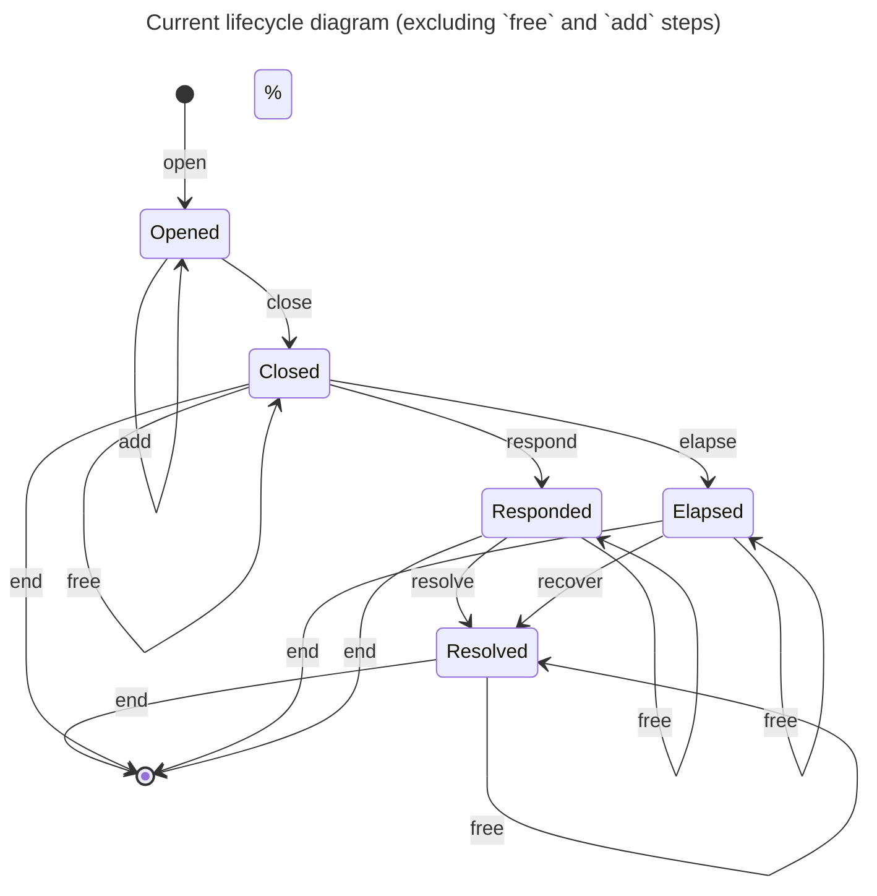
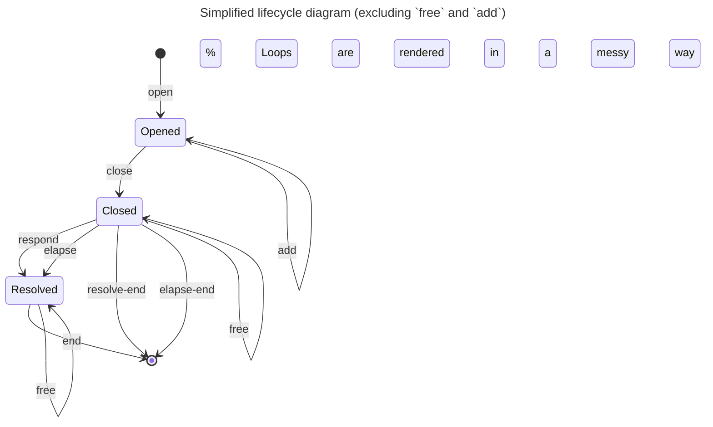

---
title:
  "merge elapsed, responded and resolved stages into a single resolved stage"
status: proposed
authors:
  - "@paluh"
date: 2025-10-10
tags:
  - lifecycle
---

## Context

In the current protocol design the channel lifecycle consists of five stages:



We have three post-closure stages: `Responded`, `Elapsed` and `Resolved`. Both
stages
`Responded and `Elapsed`are somewhat similar because one of the partners already withdrew unlocked part of their funds.`Resolved`
stage is subsequent stage in which both partners already taken their unlocked
funds and only locked pends remain.

This representation has clear semantic meaning but introduces unnecessary
complexity to the protocol and also implies a lot of redundant operations: all
of those stages provide ability to loop using a `free` step and all of them
allow to unstage the channel using an `end` step in certain nearly identical
conditions.

## Decision

### Preamble

In order to avoid repetition of steps we propose merging the `Elapsed`,
`Responded` and `Resolved` stages into a single `Resolved` stage.

### Simplified channel lifecycle



### Merging the stages

All three stages which we propose to merge are similar in nature:

- At least one of the partners already withdrew their funds from the channel.

- Both partners provided their settlement information on-chain.

- The state contains two list of pends which can be freed by either partner.

- Under certain conditions the channel can be unstaged from every of these
  stages.

The only slight difference is that the existing `Resolved` stage does not
contain any remaining funds beside the locked pends. We propose to add a
`non_resolver_amount` field to the `Resolved` stage to keep track of the
remaining funds and enforce withdrawal when appropriate user performs a `free`
or `end` step.

The final structure of the `Resolved` stage would be as follows:

```Aiken
pub type Resolved {
  non_resolver_amount: Amount,
  resolver_pends: Pends,
  non_resolver_pends: Pends
}
```

### Rationale

Prototyping phase proved that the propose similification reduces the complexity
of the implementation. The number of `end` and `free` steps is reduced
significantly. It seems that the implementation is also easier to reason about
and it does not introduce any significant drawbacks.

## Discussion, Counter and Comments

\-

## Consequences
