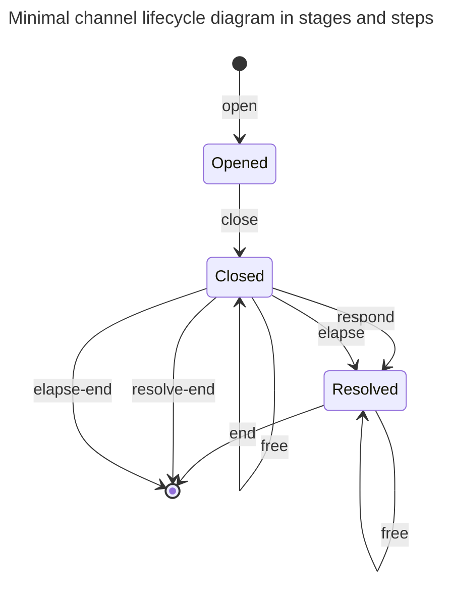

---
title:
  "merge elapsed, responded and resolved stages into a single resolved stage"
status: proposed
authors:
  - "@paluh"
date: 2025-10-10
tags:
  - lifecycle
---

## Context

Proliferation of the stages in the protocol introduces unnecessary complexity
and redundancy across `end`, `free` and two extra `resolve` steps. Prototyping
phase proved that having three stages significantly simplifies the
implementation.

## Decision

In order to avoid repetition of steps we propose merging the `Elapsed`,
`Responded` and `Resolved` stages into a single `Resolved` stage.

The final structure of the `Resolved` stage would be as follows:

```Aiken
pub type Resolved {
  non_resolver_amount: Amount,
  resolver_pends: Pends,
  non_resolver_pends: Pends
}
```

### Preamble

### Channel lifecycle



### Merging stages

All three stages which we propose to merge are similar in nature:

- At least one of the partners already withdrew their funds from the channel.

- Both partners provided their settlement information on-chain.

- The state contains two list of pends which can be freed by either partner.

- Under certain conditions the channel can be unstaged from every of these
  stages.

The only slight difference is that the existing `Resolved` stage does not
contain any remaining funds beside the locked pends. We propose to add a
`non_resolver_amout` field to the `Resolved` stage to keep track of the
remaining funds and enforce withdrawal when appropriate user performs a `free`
or `end` step.

### Rationale

\-

## Discussion, Counter and Comments

\-

## Consequences

\-
