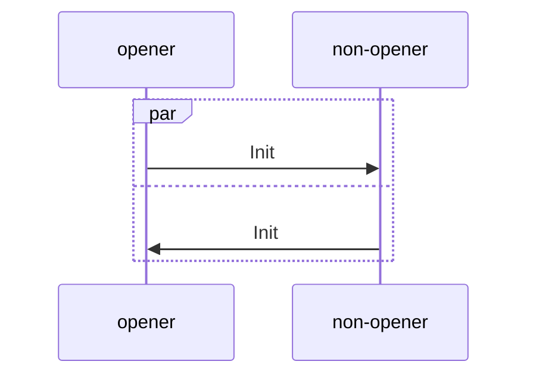
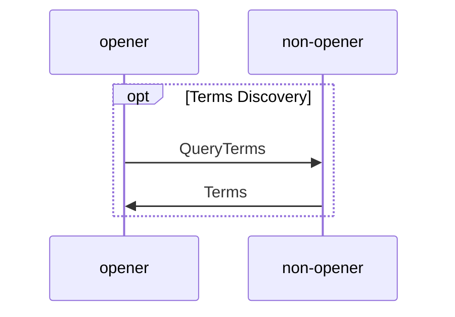
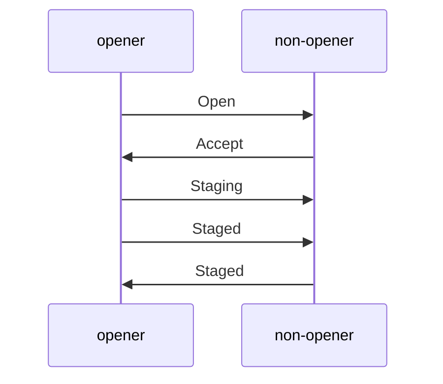
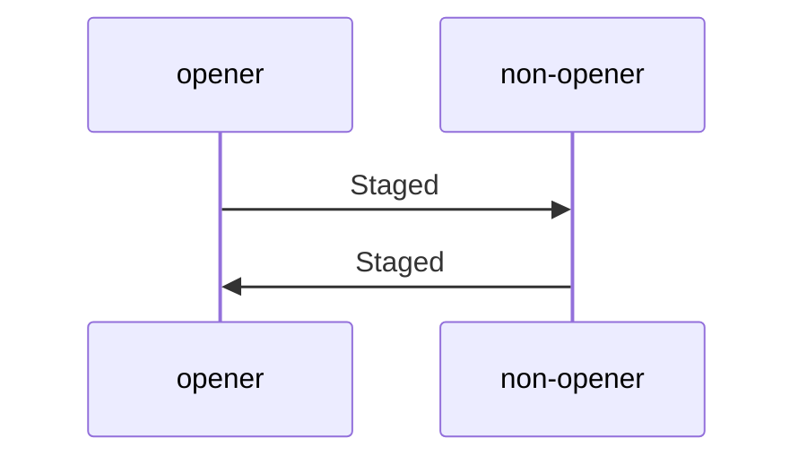
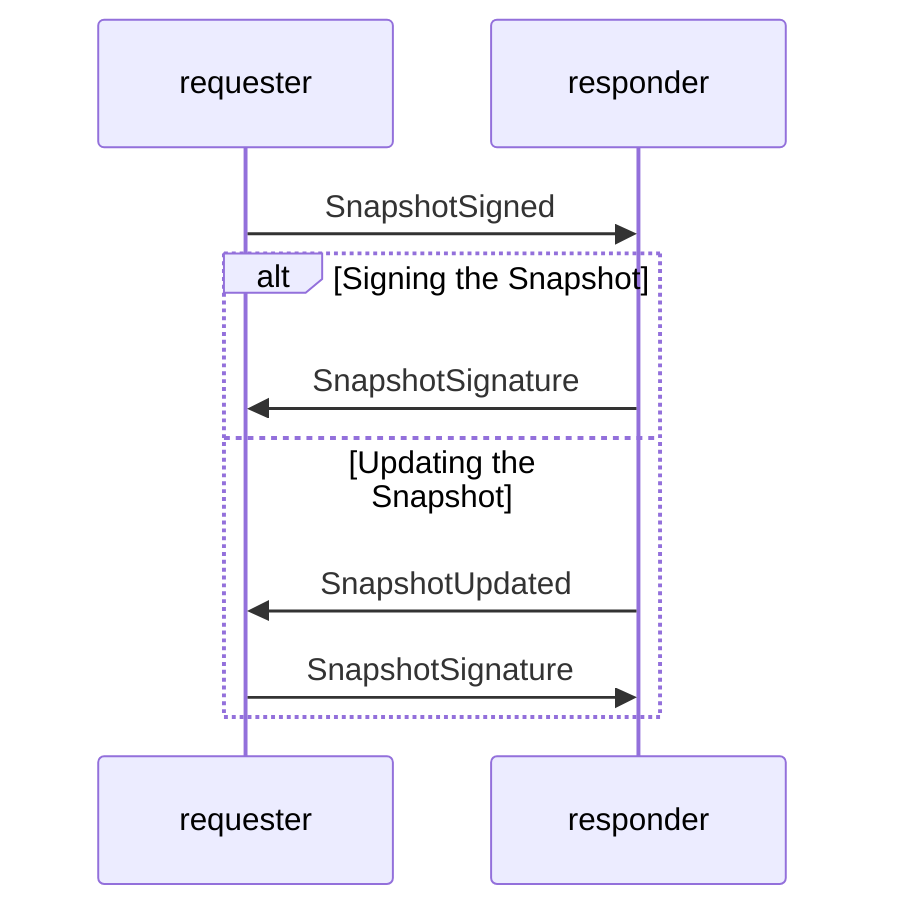
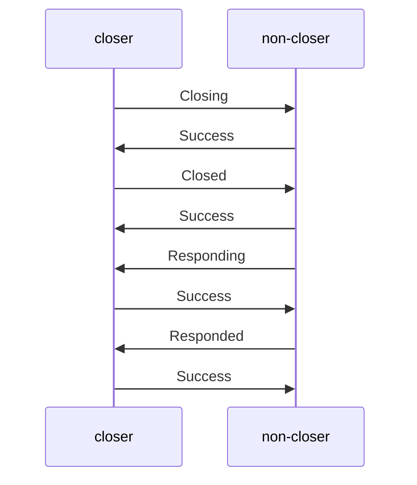

## Intro

### Scope

This document covers the communication protocol between two peers - CL nodes
which wish to establish and manage lightning channels between each other. It
defines messages and exchange flows required to achieve this task. We loosely
follow and cover the scope of the related BLN specs
[bolt#0](https://github.com/Lighting/bolts/blob/master/00-introduction.md)
[bolt#1](https://github.com/lighting/bolts/blob/master/01-messaging.md) and
[bolt#2](https://github.com/lightning/bolts/blob/master/02-peer-protocol.md)
Please note that we omit interactive transaction building, as any multisig based
steps (like dual funding) are out of scope for this version of the protocol,
even though they will be supported by the L1 validator.

The node authentication and the transport layer specification is out of the
scope of this document. However, we will assume in one instance that
[`libp2p`](https://libp2p.io) will be part of our tech stack.

We require that the transport layer protocol either delivers messages reliably
or fails, and we assume that the messages are delivered in order. This last
assumption can be removed in the future versions of the protocol but for now it
allows us to use more straightforward message handling and skip a few failure
recovery scenarios.

### Signposting

- For a gentler intro to CL, check out the
  [blog](https://cardano-lightning.org/blog) and the
  [minimal lifecycle ADR](../ards/minimal-lifecycle.md) for a general
  introduction to the channel lifecycle.
- For terms, see the [glossary](../glossary.md)
- For explanations on how to read this spec, see the appendix.

### Formats Used

We decided to use [Protocol Buffers](https://protobuf.dev/) for the message
serialization. Currently the spec uses pseudocode (in Haskell) PureScript) for
the message definitions because it should easier to read. The final protobuf
definitions will be provided in a separate document. We describe many invariants
using indicative types or aliases (like `Positive`, `Natural` but also
`Milliseconds`, `POSIX` etc.) in the pseudo code so we can avoid repeating most
of them in the text.

### Signed Structures (`CBOR` encoded)

Some parts of the protocol require signatures under `CBOR` encoded structures
(`Cheque` and `Snapshot`) which are not directly exchanged between peers but
rather reconstructed on the both sides. We specifically use `CBOR` not only
because it suits our purpose well but also because Cardano L1 uses that format
natively. These payloads will be specified separately.

## Design

### Overview

The CL nodes need a way to efficiently communicate in order to initiate and
manage the channels. We don't want to trade simplicity and ease of debugging for
efficiency, though. That is why we do not hesitate to introduce regular
request-response flows in many of the protocol conversations. This choice should
reduce the requirement for retransmissions, simplify error handling, and also
make reasoning about the shared channel state much easier.

### Message Types

We can identify distinct groups of messages:

- Global-level and possibly channel-independent conversations, which include
  initial handshaking, connection maintenance, and top level error reporting and
  logging.

- Channel-level communication, which is multiplexed by `channelId`, includes all
  the messages related to the channel lifecycle.

### Message Interaction Patterns

The protocol uses a hybrid communication model. The initial handshake and
channel establishment are fully synchronous and follow a predetermined set of
messages. The channel operations are asynchronous and pipelined. All the
channel-related messages are multiplexed using the `channelId`. All the
asynchronous conversations are tagged by `conversationId`.

By design, we avoid synchronization points which would require both parties to
block the regular channel operations. We have successfully avoided them in the
current version and believe we have preserved ease of reasoning at the same
time.

## The Protocol

We assume that the secure communication channel is already established between
two peers and that authentication of the partners nodes has already been done.
We also assume that there is a way to identify the connection initiator either
through the transport layer or through a separate election mechanism. Using that
knowledge, we assign the `initiator` and `non-initiator` roles per connection.
Peers recognize these roles and keep them during the whole connection lifecycle.

### Error Reporting and Connection Management

As stated above, most of the communication is multiplexed by channel. There are
a few messages which can be exchanged on the global level through the lifetime
of the session.

#### `Warning`

For global-level or channel-level non-critical problem reporting a node can send
a `Warning` message.

```haskell
data Warning = Warning
  { channelId :: Maybe ChannelId
  , message :: Text
  }
```

The sending node:

- MAY continue operation after sending `Warning` or MAY close the connection and
  stop responding to the peer.

The receiving node:

- MAY continue operation after receiving `Warning` or MAY close the connection
  and stop responding to the peer.

#### `Error`

For critical error reporting either on the global-level or on the channel-level
(invalid signatures, state inconsistencies, violation of negotiated terms) we
reuse the same `Error` message type. We want to follow pretty restrictive
approach taken by BLN and fail the channel(s).

```haskell
data Error = Error
  { channelId :: Maybe ChannelId
  , message :: Text
  }

```

`Error` message is currently used in many places to close some negotiation step
as it suites that purpose well - in those scenarios we want to report and finish
the channel related exchange. On the other hand in many other places we use
`Success`/`Failure` responses to acknowledge the message reception and to report
non-fatal errors which are somehow expected. These two messages will be
introduced in the following sections.

#### `Ping`

To allow for a long-lived TCP connections and to detect unresponsive peers,
nodes can send ping messages. In this version, we opt to use the `libp2p`
builtin protocol for that:
[https://docs.libp2p.io/concepts/introduction/protocols/ping/]

This particular protocol cannot be used for traffic obfuscation as it has
constant-size messages. We can revisit that decision in the future.

### Handshaking

#### `Init`

Once a connection is established, both peers MUST send an `Init` message before
any other messages. This is the first message revealing the features supported
by the sending node.

A node:

- MUST send `Init` as the first message for any connection.
- MUST wait to receive `Init` before sending any other messages.
- SHOULD close the connection with an `Error` if the peer doesn't support the
  possible version, required features or network.

##### The Full Conversation



##### The Messages

```haskell
type TestnetMagic = Integer

data NetworkId = Mainnet | Testnet TestnetMagic

type Version = Integer

type Blake2b224Hash = ByteString
type ScriptHash = Blake2b224Hash

-- maximum 32 bytes
type TokenName = ByteString
type Currency = (ScriptHash, TokenName)

data Init = Init
    { version :: Version
    , networkId :: NetworkId
    , currencies :: [Currency]
    , routing :: Bool
    , htlc :: Bool
    }
```

### Channel Lifecycle: Establishing

#### Overview

The main purpose of this phase is to minimize the probability of the failure and
possibly exchange fresh keys which should be used in the opening channel.

This phase consists of few sections but it is really a single conversation with
an optional terms discovery part. The message exchange is strictly turn based
and sequential. We distinguish the `opener` and `non-opener` roles in the
conversation.

#### Terms Discovery

To simplify the opening process nodes expose terms discovery endpoint. Accepted
values can change over time so they MAY be rediscovered during every new opening
to minimize failure ratio. We propose this mechanism to simplify the error
reporting and handling during the opening phase.

##### The Full Conversation



##### The Messages

```haskell
type Positive = Integer -- Positive integer
type Natural = Integer  -- Positive integer including 0
type Amount = Natural
type Markdown = Text
type Milliseconds = Natural

data QueryTerms
  = QueryTerms
    { currency :: Currency
    }

data Terms
  = Terms
    { currency :: Currency
    , maxHtlcCount :: Natural
    -- ^ Maximum number of HTCL (below the protocol limit)
    , maxHtlcAmount :: Amount
    , maxTotalHtlcAmount :: Amount
    , minPeerFunding :: Amount
    -- ^ Minimum funding required from peer
    , minGiftAmount :: Amount
    -- ^ Minimum "service fee" required
    , minGiftBasisPoints :: Natural
    -- ^ Used above the `minGiftAmount`. 1bp=0.01%
    , minRespondPeriod :: Milliseconds
    -- ^ Mimal delta before `elapse` can be performed after `close`
    , payoutTimeoutDelta :: Milliseconds
    -- ^ Used during HTLC cancelation in the payback cheque
    , termsAndConditions :: Maybe Markdown
    }

newtype QueryError =
  QueryError
    { supportedCurrencies :: [Currency]
    }
```

The above mechanism have many limitations. It is impossible to encode on the
`Terms` level any dependency between the parameters - for example
`minResponsePeriod` could depend on the amount of funds locked in a channel.
Given that limitations and dynamic nature of the terms themselves the `opener`
SHOULD expect that even for an opening proposition which fulfils per field
requirements can still be rejected. More involved policies can use
`termsAndConditions` field to provide more human readable informations.

#### Opening

Starting from this part of the `Establishing` phase all the messages should
include the `channelId` value. Before the beginning the `opener` should create a
new `channelId` which requires a committing to a specific utxo under the hood.
Please check [channelId ADR](../adrs/channel-id.md) for more details how the
`channelId` should be derived and its structure.

```haskell
data ChannelId = TokenName
-- ^ 20 bytes of some hash plus extra metadata - 32 bytes in total

type ChannelMessage msg = (ChannelId, m)
```

The opening consists of a simple negotiation where the `openner` proposes the
channel parameters and the `non-opener` accepts them with possible adjustments.
Then the `opener` either responds with a `Staging` message which acknowledges
the final channel parameters or fails the channel.

Both parties can generate dedicated verification key for the channel or reuse
the old ones.

##### The Full Conversation



##### The Messages

```haskell
-- 32 bytes of Ed25519 public key
type VerificationKey = ByteString

data Open
  = Open
    { currency :: Currency
    , fundingAmount :: Amount
    , giftAmount :: Amount
    , respondPeriod :: Milliseconds
    , minimumDepth :: Positive
    , maxHtlcAmount :: Amount
    , maxTotalHtlcAmount :: Amount
    , maxHtlcCount :: Positive
    , verificationKey :: VerificationKey
    }

data Accept
  = Accept
    { respondPeriod :: Milliseconds
    , minimumDepth :: Positive
    , minHtlcAmount :: Amount
    , maxHtlcAmount :: Amount
    , maxTotalHtlcAmount :: Amount
    , maxHtlcCount :: Positive
    , verificationKey :: VerificationKey
    }
```

#### Staging

The actual channel establishment concludes in the `Staging` phase. The `opener`
after preliminary and not obliging negotiation can proceed and submit the
transaction. He should await for required amount of on-chain confirmations
before sending the `Staged` message. The `non-opener` should confirm the
transaction and await for the `ChannelStaged` message.

After this step both parties should confirm that the creation transaction
reached required depth and they enter start the channel operating phase. During
this phase we assume that all the failures are fatal so we use the `Error`
message to report them. Some of the errors can be replaced with more specific
messages in the future.

##### The Full Conversation



##### The Messages

```
type Blake2b256Hash = ByteString

type TxId = Blake2b256Hash

type TxOutRef = (TxId, Integer)

data Staged = Staged { txOutRef :: TxOutRef }
```

### Channel Lifecycle: Operating

During this phase all the messages are exchanged in a fully asynchronous and
pipelined manner. We tag all the conversation with a unique identifier which is
repeated across the messages. The partners keep an independent sequence number
which is used for an `id`. To avoid collisions `initiator` uses even numbers and
`non-initiator` uses odd numbers. In the context of conversation we use the term
`requester` for the party which starts the conversation and `responder` for the
other party.

```haskell
type ConversationId = Natural
-- ^ Initiator uses even numbers, non-initiator uses odd numbers
-- when starting a conversation.

type ConversationMessage msg = (ConversationId, msg)
```

#### `Success` and `Failure`

In the context of conversations we introduce two generic responses which are
used for acknowledgements and non fatal error reporting. These messages can be
replaced with more specific ones in the future.

```haskell
data Success = Success
newtype Failure = Failure { message :: Text }
```

#### Cheque Management

All cheque related conversations are tagged with cheque `Index`.

```haskell
type ChequeMessage msg = (Index, msg)
```

Given the above we don't include the `Index` in the below message definitions.

Cheque related conversations consists of request response pairs. We use
`Success` and `Failure` for the responses in most cases.

### Managing Offered Cheques

#### Issuing and Raising Cheques

The issuer is able to propose a cheque and increase an amount of the cheque. The
moment a signature for a given cheque is created it should be considered as
committed even if the cheque is not yet accepted by the confirmed by the
counterparty.

```haskell
type Hash = ByteString
type Lock = Sha256Hash

-- 64 bytes of Ed25519 signature
type Signature = ByteString

data Add
    = Add
        { amount :: Amount
        , lock :: Maybe Lock
        -- ^ Empty for normal cheques
        , signature :: Signature
        }

data Raise
    = Raise
        { amount :: Amount
        -- ^ the new total amount
        , signature :: Signature
        }
```

#### Expiring Cheques

`Timeout` message informs the partner that a given cheque has expired. During
the next [`Squashing`](#Squashing) its index MUST be accounted for in the
`Squash` but with null value. Responder MUST return either `Success` or
`Failure` message.

```haskell
data Timeout = Timeout
```

### Managing Received Cheques

#### Fulfilling Cheques

When receiver of a conditional cheque learns the secret it can be unlocked on
L1. The cheque is time limited so if both parties wish to preserve the channel
open it should be normalized in order to remove the deadline.

```haskell
-- 65 random bytes - the preimage of the lock
type Secret = ByteString
data Normalize
    = Normalize
        { secret :: Secret
        -- ^ Lock secret
        }

data Normalized
    = Normalized
        {  signature :: Signature
        -- ^ Signature for a new normalized cheque
        }
```

#### Cancelling Cheques Through Paybacks

The locked cheque cancellation should be propagated in the receiver to the
sender direction. To illustrate the process let's imagine that the final
recipient who knows the secret wishes to cancel the payment (of course this
action can be coordinated through separate channel with the buyer). The final
recipient can do this by announcing that the secret will be never revealed and
by issuing a payback cheque. This process of payback issuance can be now safely
continued upstream to the sender.

The cancellation can be expressed through issuance of a payback cheque of the
same amount locked (or amount lowered by some fee) using the same lock. The
timeout of the payback cheque should be strictly lower than the timeout of the
original cheque - this delta is indicated through `paybackTimeoutDelta` .

The benefit of that approach is that we preserve atomicity of the operation -
the cancellation is expressed through payback committed right away. During the
next [Snapshotting](#Snapshotting) both cheques MUST be squashed.

```haskell
type POSIX = Milliseconds

data Cancel
    = Cancel
        { index :: Index
        -- ^ Index of the new payback cheque.
        -- The cancelled cheque index is part of the `ChequeMesssage`
        -- envelope.
        , timeout :: POSIX
        -- ^ Timeout should be strictly lower than the timeout of the original cheque
        , signature :: Signature
        -- ^ Signature for the new payback cheque
        }
```

#### Snapshotting

##### Overview

When the channel is operational and not quiescent both partners work with
possibly partial knowledge of the channel state. None of them can be sure what
is the latest set of commitments from the other party side - most recent cheques
updates can be still on the way. Additionally none of the partners can assume
what should be the next squashing accounting strategy of the other partner. On
the peer protocol level we want to minimize the necessity for any
synchronization points which would require both parties to block the regular
channel operations.

Fortunately in contrast to HTLCs and the commitment scheme present in the BLN in
CL:

- Cheques are atomic and self contained commitments.
- Any two valid `Snapshot`s provided by the both partners can be unified safely
  (please check the [../adrs/minimal-state.md] for more details).

Given the two properties `Snapshotting` can be considered an operation which is
optional from the security perspective but essential from the operational angle.
Through squashing partners make "room" for new pending HTLCs commitments or
regular cheque "threads".

##### The Full Conversation

The main goal of the `requester` in this conversation is to create a snapshot
which squashes the other's cheques. Only the `requester` is allowed to decide
which cheques won't be `raised` any more and accounted for in the other's
`Squash`. Symmetrically he is not able to squash own cheques right away so the
initial `SnapshotSigned` request contains the latest own `Squash` confirmed by
the partner. If there was no `Squash` confirmed by the partner yet the
`requester` should use an empty `Squash` as the other's `Squash` (check the
[../adrs/minimal-state.md] for more details). The `reponder` who receives
already signed snapshot can just accept it and respond with `SnapshotSignature`
but can also update the other `Squash` in the `Snapshot` and send it back with
the signature in the `SnapshotUpdated` message.



##### The Messages

```haskell
data Exclude = [Index]

data Squash =
  { amt :: Amount
  , idx :: Index
  , exc :: Exclude
}

data Snapshot = Snapshot
  { sq0 :: Squash
  , sq1 :: Squash
}

data SignedSnapshot = SignedSnapshot Snapshot Signature

dat SnpashotUpdated = SnapshotUpdated Snapshot Signature

data SnapshotSignature = SnapshotSignature Signature
```

### Channel Lifecycle: Closing

The closing phase serves purely informational purpose to possibly speed up the
process of the transaction submission. After triggering a `close` step on the
`L1` a given partner will not accept any new cheques. Theoretically he could
issue new cheques or perform `Squashing` but we recommend to stop any new
operations.

Partners may notify about the settlement of the step transactions before the
required `minimumDepth` is reached. Partners can retransmit some of the messages
in the case of rollbacks.

#### The Full Conversation

All the `Success` responses encode acknowledgement of the message reception.



#### The Messages

```haskell
data Closing = Closing

data Closed = Closed

data Responding = Responding

data Responded = Responded
```
