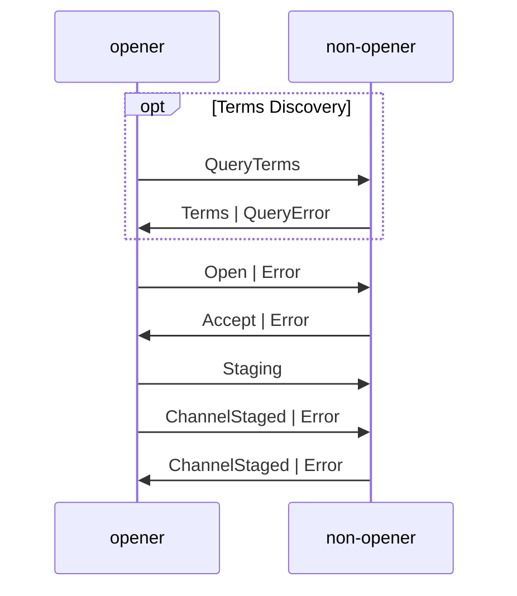
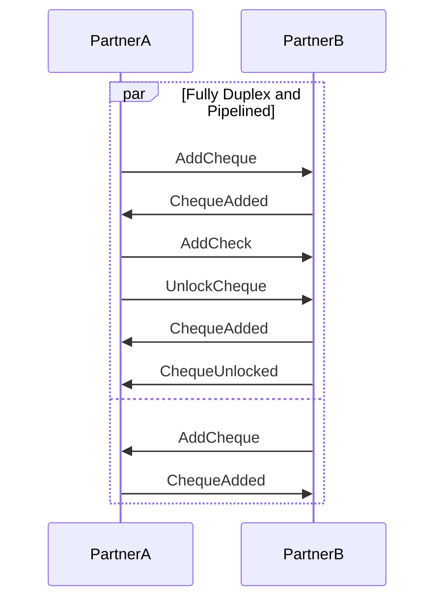
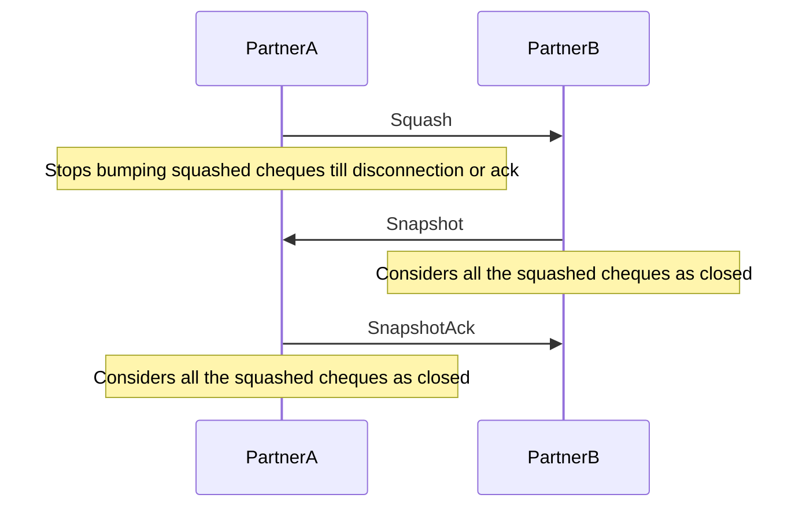

## Intro

### Scope

> Key points:
>
> - We will use libp2p so `ping` will be provided out of the box and we don't
>   cover that part.
> - Transport layer with encryption will be covered by separate spec but we will
>   relay on standard libp2p capabilities.
>   - We assume that transport layer is reliable and delivers messages in order.

This document covers the communication protocol between two peers - CL nodes
which wish to establish and manage lightning channels between each other. It
defines messages and exchange flows required to achieve this task. We loosely
follow and cover the scope of the BLN
[bolt#0](https://github.com/Lighting/bolts/blob/master/00-introduction.md)
[bolt#1](https://github.com/Lighting/bolts/blob/master/01-messaging.md) and
[bolt#2](https://github.com/lightning/bolts/blob/master/02-peer-protocol.md) in
this document. Please note that we miss interactive transaction building because
any multi-sig based stepping (like dual funding) is out of scope for this
version of he protocol even though it will be supported by the L1 validator.

The node authentication, transport layer specification is out of the scope of
this document though. In few places we will assume that we will some compents
form `libp2p` but choice of that lib will be discussed separately.

We also require that the protocol used for transport layer delivers messages
reliably or fails and that the messages are delivered in order. The last
assumption can be removed in the future versions of the protocol but for now it
allows us to use more straightforward message handling and failure recovery.

### Signposting

- For gentler intro to CL, check out the
  [blog](https://cardano-lightning.org/blog) and the
  [minimal lifecycle ADR](../ards/minimal-lifecycle.md) for a general
  introduction lifecycle of the channel.
- For terms, see the [glossary](../glossary.md)
- For explanations on how to read this spec, see the appendix.

### Formats Used

> Key points:
>
> - We use protobuf for message serialization.
> - We use CBOR for some payloads like `cheque` and `snapshot`.
> - We use pseudo-code to describe the messages in this phase.

We decided to use [Protocol Buffers](https://protobuf.dev/) for the message
serialization. Currently the spec uses pseudo code (similar to
PureScript/Haskell) for the message definitions as they are easier to read. The
final protobuf definitions will be provided in a seapate document.

Some parts of the protocol require signatures under CBOR encoded structures
(`cheque`, `snapshot` etc.) which are not directly exchanged between peers but
rather reconstructed on both sides. We use specifically CBOR not only because it
suites that purpose well but also because Cardano L1 uses that format. These
payloads will be specified separately.

## Design

### Overview

> Key points:
>
> - Channel partners need a way to efficiently and securely communicate (but
>   security is out of scope).
> - Implementators need a protocol which is clear and easy to follow and debug.
> - Efficency is important especially in the high throughput context
>   (hub<->hub).
> - This is an initial version of the protocol so we want to keep an eye on the
>   efficiency but favor simplicity and ease of resoning and debugging.

### Message Types and Protocol Phases

> Key points:
>
> - We can distinguish two types of messages and phases:
>   - Global level and possibly channel independent conversations which relate
>     to handshaking and connection maintainance.
>   - Channels management:
>     - The rest of the messages are multiplexed by channel.
>     - Channel management phases: Establishing, Operating, Retiring

### Message Interaction Patterns

> Key points:
>
> - Protocol uses hybrid communication model.
> - Fully synchronous and turn based flows involving longer conversations:
>   - handshake
>   - channel establishment
>   - any future conversation which require quiecence:
>     - possibly `dual-close` permission issuing
>     - possibly `sub` permission issuing
> - Asynchrous and pipelined messaging with aknowledgments.
>   - normal/locked cheque issuence
>   - htlc fullfilment/timeout
>   - htlc cancelation
>   - Snapshot signing

task and can use some predefined messages found in this library like
[`Ping`](https://docs.libp2p.io/concepts/introduction/protocols/ping/).

Each peer connection MUST use a single, shared link for all channel messages,
with messages distinguished by their channel IDs.

## The Protocol

### Handshaking and Connection Maintainance

### Channel Lifecycle

#### Establishing

#### Operating

#### Retiring

## The Protocol

We assume that the secure communication channel is already established between
two peers and that authentication of the partners nodes is done already. We also
assume that there is a way to identify the connection initiator either through
the transport layer or through separate election mechanism (pub key ordering
etc.). We use that knowledge to assing the `initiator` and `non-initiator` roles
per connection. Peers recognize these roles and keep them during the whole
connection lifecycle.

### Error Reporting and Connection Manangement

As stated above most of the communication is multiplexed by channel there are
though few messages which can be exchanged on the global level through the
liftetime of the session.

#### `Warning`

For global level or channel level non critical problem reporting a node can send
a `Warning` message.

```haskell
data Warning = Warning
  { channelId :: Maybe ChannelId
  , message :: Text
  }
```

The sending node:

- SHOULD include `channelId` if the problem is related to a specific channel.
- MAY continue operation after sending `Warning`or MAY close the connection and
  stop responding to the peer.

The receiving node:

- MAY continue operation after receiving `Warning` or MAY close the connection
  and stop responding to the peer.

#### `Error`

For global level error handling which should indicate that there is a critical
problem (invalid signatures, state inconsistencies, violation of negotiated
terms) we want to follow pretty restrictive approach taken by BLN and fail the
channel(s). To express such a criticial missbehaviour the `Error` message is
used.

```haskell
data Error = Error
  { channelId :: Maybe ChannelId
  , message :: Text
  }

```

The sending node:

- SHOULD send `Error` for protocol violations or internal errors that make
  channels unusable.
- MAY include `channelId` if the problem is related to a specific channel.
- MAY send `Error` with empty `channelId` with in reply to messages related to
  unknown channels.

The receiving node:

- MUST fail the channel with the provided `channelId` if it exists.
- MUST fail all channels with the sending node if `channelId` is not provided.

#### More Precise Error Handling

Beside the above generic failure reporting mechaisms the protocol contains
context specific responses which can be useful for automatic recovery.

#### `Ping`

To allow for a long-lived TCP connections and to detect unresponsive peers,
nodes can send ping messages. In this version we opt to use the `libp2p` builtin
protocol for that: https://docs.libp2p.io/concepts/introduction/protocols/ping/

This particular protocol can not be used for traffic obfuscation as it has
constant size messages. We can revisit that decision in the future.

### Handshaking

#### `Init`

Once a connection is established, both peers MUST send an `Init` message before
any other messages. This is the first message revealing the features supported
by the sending node.

```haskell
type TestnetMagic = Integer

data NetworkId = Mainnet | Testnet TestnetMagic

type Version = Integer

type Blake2b224Hash = ByteString
type ScriptHash = Blake2b224Hash

-- maximum 32 bytes
type TokenName = ByteString
type Currency = (ScriptHash, TokenName)

data Init = Init
    { version :: Version
    , networkId :: NetworkId
    , currencies :: [Currency]
    , routing :: Bool
    , htlc :: Bool
    }
```

> QUESTION: Banning:
>
> - Every node have full right to ban anyone.
> - Should we allow polite banning with an Error.
> - For sure we should allow even before the handshake to minimize resource
>   consumption.

A node:

- MUST send `Init` as the first message for any connection.
- MUST wait to receive `Init` before sending any other messages.
- SHOULD reject if the peer doesn't support the possible version, required
  features or network by closing he connection after sending a `Warning`.

### Channel Lifecycle

> Key points:
>
> - As it was already stated all the channel specific messages are tagged by the
>   `channelId` from the beginning.
> - The channel lifecycle is divided into three phases: establishing, operating
>   and retiring.

```haskell
-- 32 bytes of some hash plus extra payload
data ChannelId = TokenName

type ChannelMessage msg = (ChannelId, m)
```

## Core Types

These are core types used in different places of the protocol:

```haskell
type Positive = Integer -- Positive integer
type Natural = Integer  -- Positive integer including 0
type Index = Natural

type Blake2b256Hash = ByteString

type Amount = Natural

type Milliseconds = Natural

type POSIX = Milliseconds

type TxId = Blake2b256Hash

type TxOutRef = (TxId, Integer)

type Ed25519PubKey = ByteString

-- 64 bytes of Ed25519 signature
type Signature = ByteString

type Exclude = [Index]

type Squash = (Amount, Index, Exclude)

type Snapshot = (Squash, Squash)

```

### Establishing

#### Overview

> QUESTION(paluh): should we change how we derive chnannelId:
>
> - We can use txOutRef+arbitrary 32 bit integer
> - These ids should be assigned in an increasing order.
> - This should add more flexibility to a concurrent channel negotiation -
>   indexes could be assigned in order but remain valid even if some of the
>   channels were not established.

This phase consists of a single conversation with some optional parts. The
message exchange is strictly turn based and sequential. We distinguish the
`opener` and `non-opener` roles in the conversation.

The messages does not include any exra conversation `id` beside the regular
`channelId`. Before the beginning the openner should create new `channelId`
which requires a commiting to specific a utxo. Please check
[channel id ADR](../adrs/channel-id.md) for more details how the `channelId`
should be derived and its structure.

> Key points:
>
> - we have a few parts of that phase: optional term discovery, channel opening
>   with its setup negotiation and the final staging of the channel on-chain.
> - up until the beginning of settlement both partners on disconnection MUST
>   drop the channel.
> - every error drops the channel and closes that message thread.

#### The Full Conversation



#### Terms Discovery

To simplify the opening process there is an optional terms discovery. Accepted
parameter ranges can change over time so they should be rediscovered during
every new opening. We propose this mechanism to simplify the error reporting and
handling.

```haskell
-- An inclusive range
data Range a
  = Range
    { minValue :: a
    , maxValue :: a
    }

data QueryTerms
  = QueryTerms
    { currency :: Currency
    }

data Terms
  = Terms
    { currency :: Currency
    , htlcCountRange :: Range Integer
    , htlcAmountRange :: Range Amount
    , totalHtlcAmountRange :: Range Amount
    , minGiftAmount :: Amount                -- Minimum "service fee" required
    , minGiftPercent :: Integer              -- Used above the `minGiftAmount`
    , peerFundingRange :: Range Amount       -- Minimum funding required from peer
    , respondPeriodRange :: Range Milliseconds
    , termsAndConditions :: Maybe Text
    }

data QueryError
  = QueryError
      { supportedCurrencies :: [(Currency, Text)]
      }
```

This mechanism have obvious limitations:

- Provided ranges can have internal dependencies - for example `responsePeriod`
  can depend on the funds locked in a channel so even though the `opener` can
  provide the final channel proposition which fullfiles per field requirements
  it can still be rejected by the counterparty. More involved policies can use
  `termsAndConditions` field to explain the details for the user.
- The list is not exhaustive - it can be extended in the future.

#### Opening and Staging

> QUESTION:
>
> - Shoudl we expand the failure scenarios - transaction can timeout etc.?
> - Should we discuss the transaction validity interval and in the future fee
>   bumping etc.?

The opening consists of a simple negotiation where the `openner` proposes the
channel parameters and the `non-opener` accepts them with possible adjustments.
Then the `opener` finally confirms the channel by sending a signed transaction
which can be submitted by both parties. After this step both parties should
confirm about the channel creation and start the operation or report an error
and drop the channel.

```haskell
data Open
  = Open
    { currency :: Currency
    , fundingAmount :: Amount
    , giftAmount :: Amount
    , respondPeriod :: Milliseconds
    , minimumDepth :: Integer
    , minHtlcAmount :: Amount
    , maxHtlcAmount :: Range Amount
    , maxTotalHtlcAmount :: Range Amount
    , maxHtlcCount :: Integer
    , pubKey :: Ed25519PubKey
    }

data Accept
  = Accept
    { respondPeriod :: Milliseconds
    , minimumDepth :: Integer
    , minHtlcAmount :: Amount
    , maxHtlcAmount :: Amount
    , maxTotalHtlcAmount :: Amount
    , maxHtlcCount :: Integer
    , pubKey :: Ed25519PubKey
    }

type Cbor = ByteString

type Transaction = Cbor

data ChannelStaging
  = ChannelStaging
    { tx :: Transaction
    }

data ChannelStaged = ChannelStaged
```

### Operating

During this phase all the messages in the current version of the protocol are
exchanged in a fully asynchronous and pipelined manner. We tag all the
conversation with unique identifier which is repeated across the conversation.
Both parties keep an indpendent sequence number which is used for an `id`. To
avoid collisions `opener` uses even numbers and `non-opener` uses odd numbers.

#### Chenque Management

This flow consists of a single request and acknowledge pairs:

- `AddCheque`/`ChequeAdded`
- `BumpCheque`/`ChequeBumped`
- `UnlockCheque`/`ChequeUnlocked`
- `TimeoutCheque`/`ChequeTimedOut`
- `CancelLockedCheque`/`LockedChequeCanceled`



#### Snaphotting


